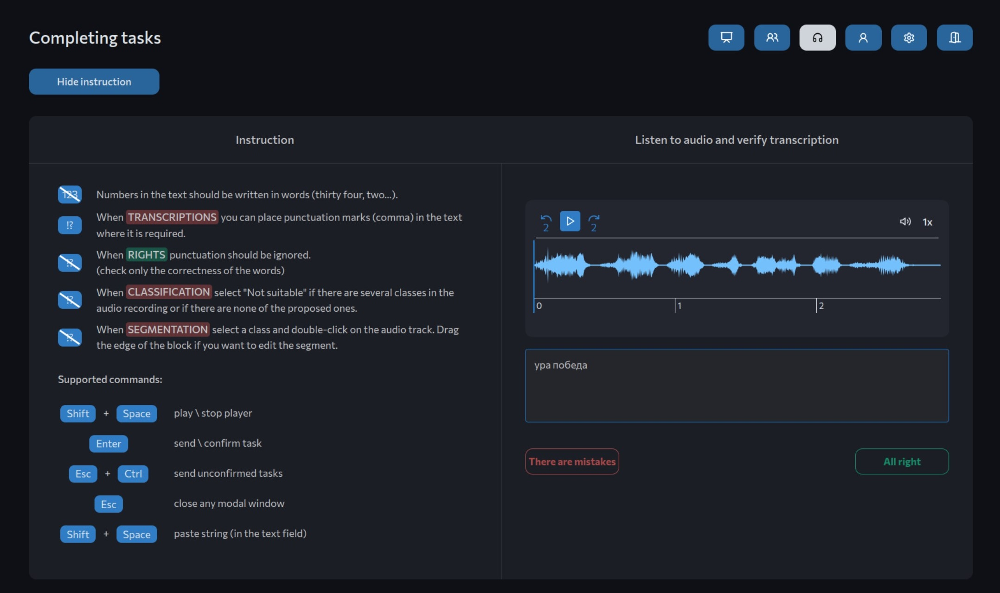

# LabelSpeech

A system for multi-user markup of audio with speech.



## Functionality

- User-friendly markup interface with hotkey control
- Collection of statistics about markup tasks performed by users
- Mechanism of additional verification of transcriptions 
- Customization of assignment types distribution among users
- Dark theme 😎

## Installation, configuration and use

The system is deployed using docker (in our case we used version 23.0.5 and docker compose version 2.17.3) as 4 containers:
- PostgreSQL DBMS - stores information about markup and users
- REST API for interacting with the database
- S3 storage Minio - stores audio files (configuration using third-party storage is possible)
- Nginx server delivering web interface

### Installation and startup

1. Clone the repository
```
git clone https://github.com/mtuciru/LabelSpeech.git && cd LabelSpeech
```

2. Copy .env.example and rename the copy to an .env file. This file contains environment variables that are used to configure system operation. The table below contains a description of each of the variables. The following variables are mandatory for self-configuration when deploying in a production environment:
	- JWT token
	- S3 storage data 
	- Administrator account credentials
	- S3 download token

3. Up the compose:
```
docker compose up -d --build
```

After the first startup, an administrator account will be created in the system with credentials from the environment settings. This account can be used to assign administrator rights to other users.

### Adding audio recordings to markup

Adding recordings with speech for markup is done via an HTTP request to the REST API application (accessible on port 8000) at the path /api/file/upload. This request requires as parameters an upload authorization token (which is set in the .env file), an audio file in MP3 format, and the original speech transcription of this file (can be an empty string). Once the request is executed, the audio file is uploaded to S3 storage and its meta-information is added to the database.

More detailed method specification can be found in Swagger documentation at http://<server_address>:8000/docs (e.g. if the server is available at 192.168.1.5, the documentation is available at http://192.168.1.5:8000/docs).

### Environment Variables

| Variable | Description                                                                                                                            |
| ----------------------- | ----------------------------------------------------------------------------------------------------------------------- |
| JWT_SECRET              | JSON WEB Token for application authorization                                                                            |
| JWT_ACCESS_EXPIRE       | Access token expiration time in minutes                                                                                 |
| JWT_REFRESH_EXPIRE      | Refresh token validity in hours                                                                                         |
| JWT_REFRESH_LONG_EXPIRE | Extended refresh token validity in hours                                                                                |
| SERVER_ADDR             | The address where the backend application will be deployed within the container                                         |
| SERVER_PORT             | The port on which the backend application will be deployed within the container                                         |
| SERVER_TEST             | Mode of uvicorn operation. For dev server should be used - true, for production server - false                          |
| DB_ADDR                 | Database Hostname                                                                                                       |
| DB_PORT                 | Port on which the database will be deployed                                                                             |
| DB_USERNAME             |  User name for working with the database                                                                                |
| DB_PASSWORD             | User password for working with the database                                                                             |
| DB_NAME                 |  Database name                                                                                                          |
| AWS_ACCESS_KEY_ID       | Identifier of the static key created in preparation for work with S3                                                    |
| AWS_SECRET_ACCESS_KEY   | Password to access S3                                                                                                   |
| AWS_REGION              | AWS infrastructure deployment region                                                                                    |
| AWS_HOST                | URL S3                                                                                                                  |
| AWS_BUCKET              | The name of the aws bucket for your S3                                                                                  |
| MAX_USERS_WITH_FRAGMENT | Maximum number of users to whom one fragment can be issued for markup                             		            |
| ADMIN_EMAIL          | Login from the basic administrator account, which is created when the application is launched for the first time        |
| ADMIN_PASSWORD          | Password for the administrator account                                                                                  |
| S3_TOKEN                | Token for uploading audio recordings to S3. Can be an arbitrary string                                                  |

## Authors
[](https://github.com/polestvr)
[](https://github.com/cuttenEDU)
[](https://github.com/RuslanZalikov)
[](https://github.com/Filadrif)
[](https://github.com/petrosyyaann)
[](https://github.com/littowl)
[](https://github.com/pndsdn)


If you use this software in your research, please cite it using the BibTeX entry from [file](https://github.com/mtuciru/LabelSpeech/blob/main/references.bib)


